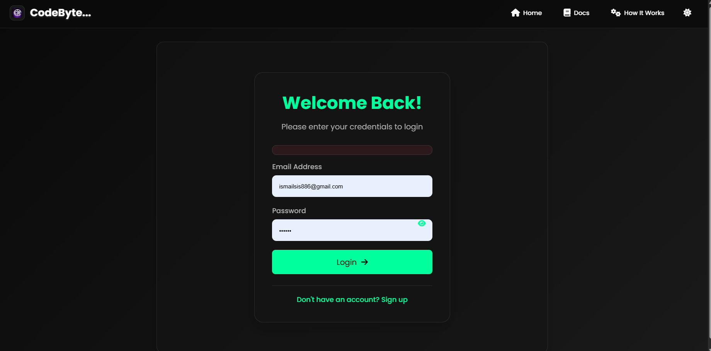
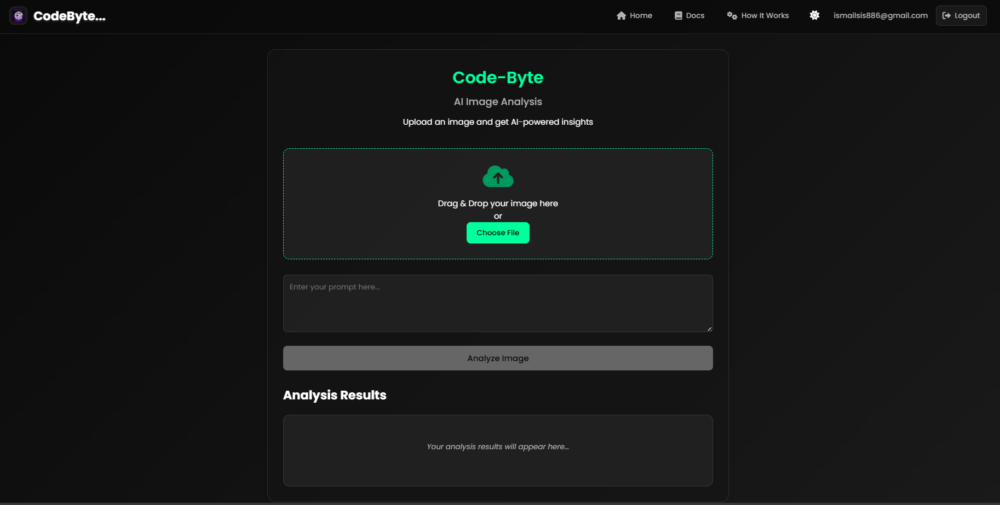
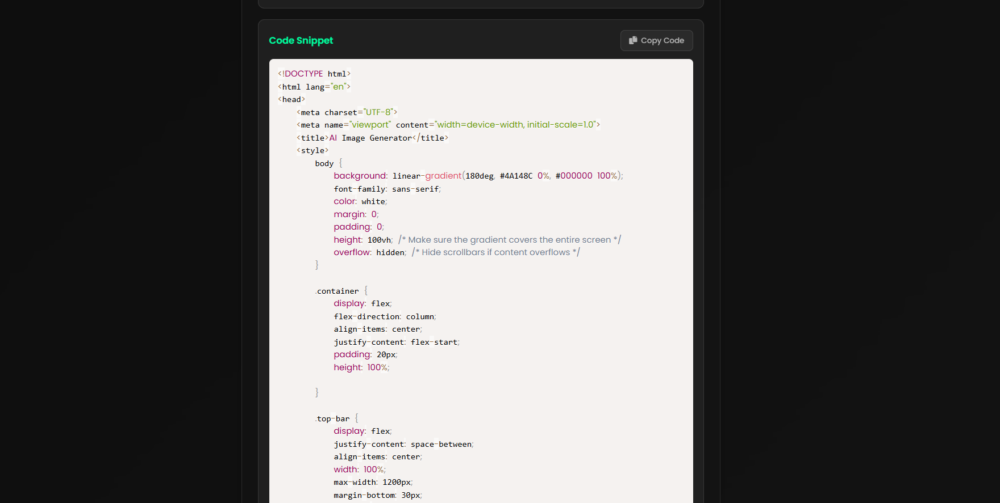

# 🧠 AI-Powered Code Generator from Image | Technophilia 2025 MIT Hackathon

  
🚀 **Built in 12 Hours | Powered by Google AI Studio & Gemini API**

## 🖼️ Project Overview

Our team participated in the **Technophilia 2025 AI Hackathon** at MIT College, Aurangabad, and developed a powerful AI software that transforms UI **images or sketches into frontend boilerplate code** (HTML/CSS). This tool empowers developers and designers by automating the process of converting wireframes or UI mockups into clean, production-ready code.

> 🔍 “From Sketch to Code in Seconds”

---
---

## 👥 Team DevStrom Members

| Name | Role | GitHub | LinkedIn |
|------|------|--------|----------|
| **[ Ismail Shaikh ]** | AI Developer & Backend (Lead)| [GitHub](https://github.com/Ismail-dcode) | [LinkedIn](https://www.linkedin.com/in/ismail-shaikh-19798a335/) |
| **[ Atharve Jaiswal ]** | Frontend Developer | [GitHub](https://github.com/Atharva-dcode) | [LinkedIn](https://www.linkedin.com/in/atharva-jaiswal07) |
| **[ Yash Gawaskar ]** | UI/UX Designer | [GitHub](https://github.com/teammate2) | [LinkedIn](https://linkedin.com/in/teammate2) |
| **[ Shreyash Jadhav ]** | AI Integration & Testing | [GitHub](https://github.com/shreyash-jadhav818) | [LinkedIn](https://www.linkedin.com/in/shreyash-jadhav-sj0818/) |

> Feel free to connect with us

---

## ✨ Features

- 🔐 **User Authentication** – Secure login system to protect access.
- 🧠 **Image to Code Generation** – Upload UI design images and get responsive HTML/CSS code.
- 🪄 **AI-Powered by Google AI Studio & Gemini** – Trained custom AI models using cutting-edge technology.
- 💻 **Frontend Preview** – Clean and responsive output for quick testing.
- ⚡ **Built in 12 Hours** – Fully functional prototype delivered in a one-day hackathon race.

---

## 🧑‍💻 Technologies Used

| Technology | Description |
|------------|-------------|
| **Node.js** | Backend server and API integration |
| **HTML/CSS** | Frontend structure and styling |
| **JavaScript** | Frontend functionality |
| **Google AI Studio** | Training and managing custom AI models |
| **Gemini AI** | Image analysis and code generation |
| **Local Auth** | User authentication and session handling |

---

## 🛠️ How It Works

1. **User logs in** using a secure authentication system.
2. **Image Upload** – The user uploads a UI sketch or design image.
3. **AI Processing** – The image is sent to the Google-trained model powered by Gemini.
4. **Code Output** – The system returns a boilerplate HTML/CSS file based on the image structure.
5. **Preview & Download** – Users can view or copy the generated code instantly.

---

## 📸 Screenshots

### 🔐 Login Page


### 🖼️ Image Upload Interface


### 🧠 Generated Code Output


---

## 🏆 Hackathon Highlights

- 📅 **Event:** Technophilia 2025 – MIT Aurangabad
- 🧠 **Theme:** Build an AI-based Solution
- ⏱️ **Duration:** 12 Hours
- 🛠️ **Team Effort:** Collaboration and AI model training within limited time

---

## 🔗 References

- [Google AI Studio](https://makersuite.google.com/) – For training and deploying the AI model.
- [Gemini API by Google](https://deepmind.google/discover/gemini/) – Used for image understanding and code generation.
- [Node.js](https://nodejs.org/) – Backend runtime environment.
- [HTML & CSS Documentation](https://developer.mozilla.org/en-US/) – For frontend structure and styling.

---

## 🧪 Getting Started

Follow these instructions to set up and run the project locally on your machine (localhost:3000).

### 🚀 Prerequisites

Make sure you have the following installed:

- [Node.js & npm](https://nodejs.org/) (v16 or higher)
- [Git](https://git-scm.com/)
- Internet connection for API and model calls

---


## 📥 Download Specific File

You can download the Project file directly:

👉 [Download `FinalCopy`](https://github.com/Ismail-dcode/Day-Hackathon-Local/tree/main/DevStrom-4th-FinalCopy)


### 📦 Installation

1. **Clone the Repository**

```bash
git clone https://github.com/Ismail-dcode/Day-Hackathon-Local.git
```
2. **FOR RUN PROJECT**
```bash

node main.js

```
2. **PREVIEW ON BROWSER TYPE**
```bash

localhost:3000

```

